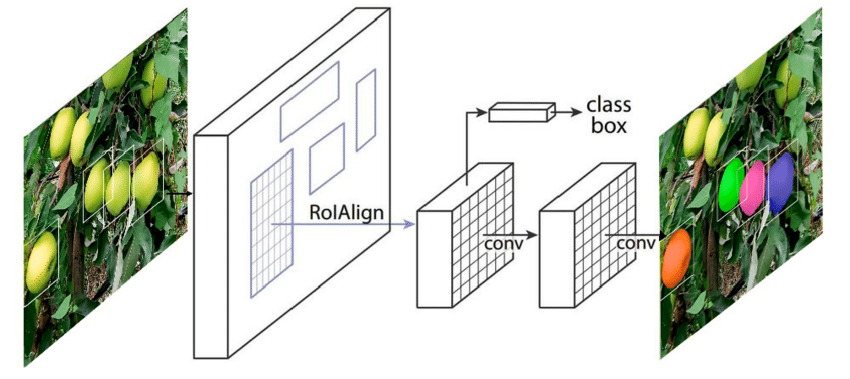
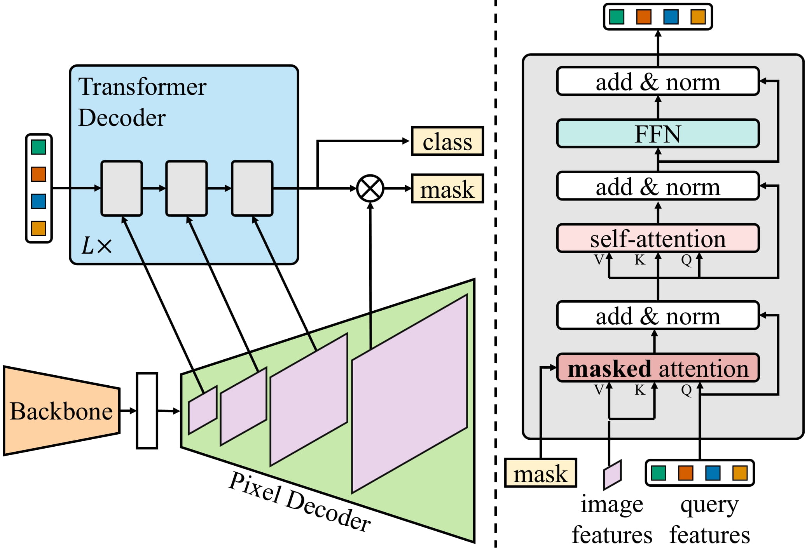
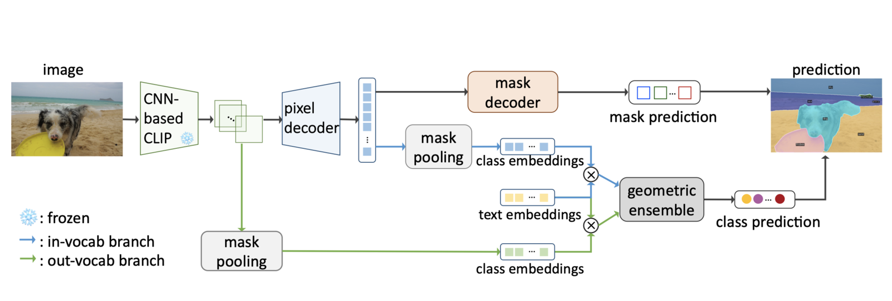

# Unbalanced Taxonomy Instance Segmentation (Master's Thesis)

This is a code repository for my Master's thesis which explores different approaches to instance segmentation in computer vision, with a special focus on conventional deep learning models and models which use language embeddings. For more details check out ```thesis.pdf```.


## Classical instance segmentation models

In the first part of the thesis, a detailed evaluation of classical models such as Mask R-CNN and Mask2Former, trained on the TACO dataset for waste segmentation, was conducted. The results show that Mask R-CNN provides solid performance, while Mask2Former encounters challenges with contextual understanding of small and visually similar waste objects. The models were then modified with a module for dynamic segmentation loss weights balancing. The technique is based on class frequencies and evaluation recall. The experiments were run again ot explore possible improvements.

### Mask R-CNN Architecture



### Mask2Former Architecture



### Instance segmentation model with language embeddings

In the second part of the thesis, the FC-CLIP model with language embeddings was investigated. It combines visual and textual information for zero-shot instance segmentation. FC-CLIP uses the CLIP model as it's backbone and demonstrated interesting results in instance segmentation with richer hand-created prompts, suggesting the need for further adjustments and exploration. The thesis offers insights into the advantages and disadvantages of different segmentation models and highlights the importance of tailoring models to specific tasks and datasets.

### FC-CLIP Architecture


